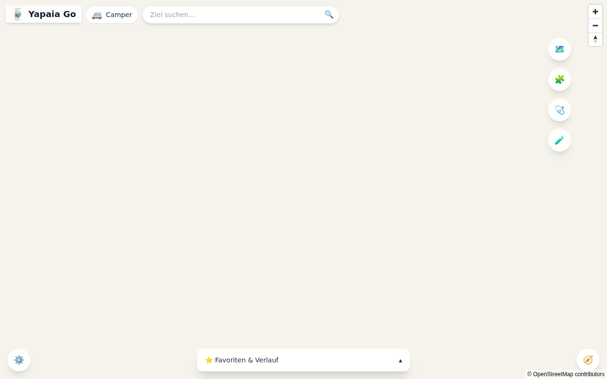
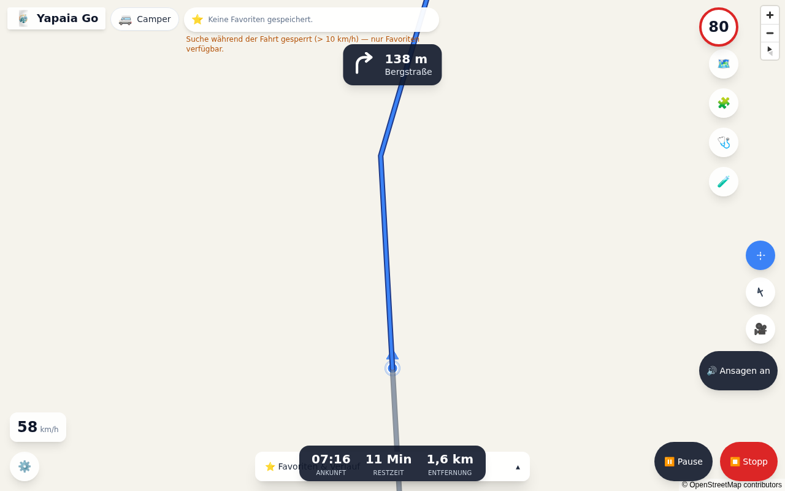
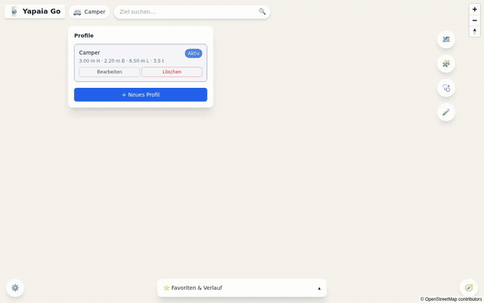
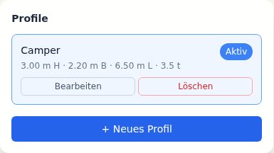
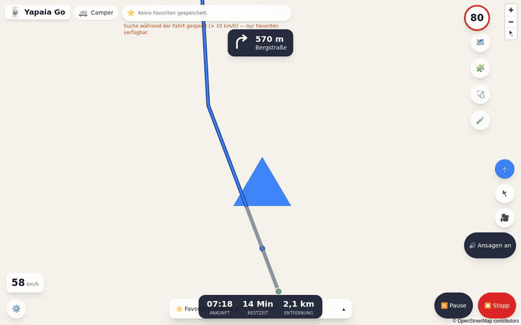
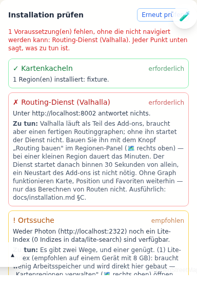

# Yapaia Go — User Manual

Everything the app can do, in plain language. You do not need to have read
anything else first.

If you just want to get driving, read [Getting started](#getting-started) and
stop there. The rest is here for when you need it.

> **About the pictures.** They are real recordings of the running app, captured
> automatically. The map background is blank in all of them because they come
> from the automated test harness, whose map fixture carries no tiles —
> everything Yapaia draws itself is real. [Details.](media/README.md)

**Contents**

1. [What you are looking at](#what-you-are-looking-at)
2. [Installing](#installing)
3. [Getting started](#getting-started)
4. [Your vehicle profile](#your-vehicle-profile) — the most important screen
5. [Finding a destination](#finding-a-destination)
6. [Driving](#driving)
7. [Where your position comes from](#where-your-position-comes-from)
8. [Home Assistant](#home-assistant)
9. [Making it yours](#making-it-yours)
10. [Maps and regions](#maps-and-regions)
11. [When something is wrong](#when-something-is-wrong)

---

## What you are looking at

Yapaia Go is a navigation system for motorhomes that runs on your own hardware
and needs no internet connection. It has two halves:

- **The engine**, running on a mini-PC in your vehicle. It holds the map, works
  out routes and knows where you are.
- **The screen**, which is just a web browser — the tablet on your dashboard,
  your phone, a laptop. Several can watch the same trip at once, because the
  trip lives in the engine and the browser only displays it.

> One caveat if you use **browser GPS** on more than one device: they all
> report to the same place, and the most recent report wins. Two devices in the
> same vehicle agree, so nothing happens. A tablet in the camper and a phone
> left at home do not, and the position will jump between them. Use a USB
> receiver or the Companion App if that is your situation.

Nothing you do leaves the vehicle. There is no account, no cloud, no telemetry.

### The two modes

**Explore mode** is what you see when nothing is running: a map, a search bar
at the top, your favourites in a drawer at the bottom.

**Drive mode** takes over once you start navigating: the map turns to face your
direction of travel, a large panel shows the next manoeuvre, and the bottom bar
carries speed, ETA, remaining distance and altitude.

Opening the panels — the vehicle profile, the favourites drawer, the health
check:

---

## Installing

### As a Home Assistant add-on

This is the recommended route and needs no terminal.

1. **Settings → Add-ons → Add-on Store → ⋮ (top right) → Repositories**
2. Paste `https://github.com/Apfelsafft/Yapaja-Go-Design` and add it.
3. Find **Yapaia Go** in the store and install it.

> **The progress bar will sit at 0 % for several minutes.** This is normal.
> Your Home Assistant is building the add-on on your own machine rather than
> downloading a finished image. Leave it alone; it is not stuck.

4. Start the add-on, then open it from the sidebar.

### Standalone

If you do not run Home Assistant, Yapaia Go also runs on its own with Docker
Compose, or in a Proxmox LXC container. See the
[Installation Guide](installation.md) (German).

### If you are short on memory

Yapaia shares RAM with everything else on the machine. A country-sized map with
address search enabled wants about 2.4–2.9 GB for Yapaia alone, and a Home
Assistant VM should have 6 GB or more in total.

If that is more than you have, in order of how much they buy you:

1. **Turn off `photon_enabled`** in the add-on options. This removes the single
   biggest consumer. Search still works through a built-in lightweight index —
   you keep place names and street names, you lose house numbers.
2. **Lower `photon_xmx_mb`** instead, if you would rather keep full search with
   a smaller memory allowance.
3. **Install a smaller region** — one state instead of a whole country. Both
   routing and search shrink with it.

---

## Getting started

On first open, a wizard walks you through five decisions. None of them are
permanent — everything can be changed later in settings.

| Step | What it asks | Notes |
|---|---|---|
| **Language and units** | German or English; metric or imperial | Affects the interface and spoken distances |
| **Map region** | Which part of the world to download | See [Maps and regions](#maps-and-regions) |
| **Vehicle profile** | Your camper's dimensions | **Take your time here** — see below |
| **Position** | Where GPS comes from | See [Where your position comes from](#where-your-position-comes-from) |
| **Home Assistant** | Whether to publish your trip to HA | Skippable; you can enable it later |

There is also a disclaimer to acknowledge. It is worth actually reading: it
says that map data on height and weight limits is incomplete, and that you
remain the driver. More on that in the next section.

---

## Your vehicle profile

**This is the screen that matters most.** It is the difference between a
navigation system and a truck navigation system.

Enter the dimensions of your camper:

| Value | Range | What it does |
|---|---|---|
| **Height** | 1.0 – 4.5 m | Keeps you out from under low bridges and tunnels |
| **Width** | 1.5 – 3.0 m | Avoids roads too narrow for you |
| **Length** | 3.0 – 20.0 m | Avoids turns you cannot physically make |
| **Weight** | 1.0 – 40.0 t | Respects weight limits on bridges and roads |
| **Average speed** | 40 – 130 km/h | Affects the ETA only, never the route |

You can also choose what to **avoid**: motorways, tolls, ferries, unpaved
roads. And you can keep several profiles — one for the camper, one for the car
you tow — but only one is active at a time.

### Measure, do not look it up

Enter what your vehicle actually measures **today, loaded, with everything on
the roof**. The manufacturer's brochure figure does not include your satellite
dish, your roof box, or the bikes on the back. A roof rack that adds 15 cm is
the difference between clearing a 3.10 m bridge and not.

Round **up**, never down.

### The warning above 2.70 m

Set a height over 2.70 m and Yapaia shows a warning. It is not being cautious
for the sake of it, and it is not a bug:

> **OpenStreetMap does not know every height limit.** Main roads are well
> mapped. Small roads, farm tracks and village archways often are not. A route
> that Yapaia considers clear may still lead somewhere you do not fit.

No offline navigation system can solve this, because the information simply is
not in the data. **Watch the road signs.** Yapaia routes you; it does not drive
for you.

Yapaia also asks you to confirm your dimensions periodically, so a profile from
two campers ago does not quietly stay in charge.

---

## Finding a destination

Type into the search bar at the top. Search works offline and tolerates typos —
`Müchen` will usually still find `München`. Results are biased towards where
you are, so the nearest match comes first.

You can also **tap anywhere on the map** to drop a destination pin — useful for
a place with no address at all: a car park in the middle of nowhere, a spot
someone showed you on their map.

### "Not down that road"

Long-press (or right-click) **on the route line itself** and Yapaia will avoid
that stretch and recalculate. This is for the case a map cannot know about: the
road you can see is flooded, blocked by roadworks, or simply looks far too
narrow for your camper once you are looking at it.

The avoidance lasts for the current trip only.

### Alternative routes

When Yapaia offers alternatives it draws them as grey lines alongside the main
route. Tap one to make it the active route.

### Stops along the way

A route can have intermediate stops, not just a destination. Add them, drag
them into the order you want, and the route follows that order. You can add a
stop **while you are already driving** — the route recalculates from where you
are now.

### Favourites

Save a place as a favourite and it appears in the drawer at the bottom of
Explore mode. Categories: home, campsite, point of interest, or your own. Your
recent destinations are kept as history too — the drawer has a tab for each.

---

## Driving

Tap **Start navigation** and the app switches to Drive mode.

**What you get:**

- **Spoken instructions**, through the browser or through a Home Assistant
  media player, whichever you have set.
- **A large manoeuvre panel** showing the next turn and the distance to it.

  

- **The current speed limit**, with a warning if you exceed it.
- **ETA, remaining distance, altitude** in the bottom bar.
- **Automatic rerouting** if you miss a turn — typically within three seconds.

### Losing GPS

Tunnels and multi-storey car parks cut the signal. Yapaia keeps estimating your
position from your last known speed and heading, so the display keeps moving
instead of freezing. When the signal comes back it snaps to the real position.

### The screen stays on

Yapaia keeps the display awake while you navigate. Where the browser supports
it, it asks the operating system directly; where it does not (older iPads, for
instance), it falls back to a trick involving an invisible looping video, which
achieves the same thing.

On some devices the browser will only allow this **after you have touched the
screen once**. If your display still sleeps, tap the map once at the start of
the trip.

### Controls lock above 10 km/h

Once you are moving faster than 10 km/h, the settings, the layout editor, the
profile editor and the full search field lock behind an overlay. Pause the
navigation or stop to change something.

This is deliberate. The threshold is configurable if it does not suit you, but
consider leaving it: the co-driver can always use their own device, which is
not the one moving at 80 km/h in the driver's line of sight.

### Pausing and resuming

Pause and stop live at the bottom right of Drive mode. If the app is reloaded
mid-trip — a browser crash, a tablet reboot — it offers to resume where you
left off.

Simply switching to another Home Assistant page and back does **not** count as
an interruption and will not ask you anything. Your trip continues in the
background regardless of what the screen is showing, because the trip lives in
the engine, not in the browser.

---

## Where your position comes from

Yapaia accepts a position from four sources. You choose in the add-on options
under `gps_source`.

| Source | Setting | Best for |
|---|---|---|
| **Browser** | `none` | Quick testing. **Only works over HTTPS** |
| **USB GPS receiver** | `usb` / `network` | The most accurate option; needs hardware |
| **HA Companion App** | `ha_tracker` | A phone you already carry |
| **Simulator** | `gps_simulator` | Trying the app without moving |

### Why the browser often will not work

Browsers only release GPS over a secure connection. If your Home Assistant runs
on plain `http://`, **no browser will give Yapaia a position** — not your
phone, not your tablet, and no setting inside Yapaia can change that. This is a
browser rule, not a Yapaia limitation.

That is what the Companion App route is for.

### Using the Home Assistant Companion App

The Companion App reports your position to Home Assistant rather than to the
browser, and it keeps reporting with the screen locked and the phone in your
pocket.

1. Set `gps_source: ha_tracker` in the add-on options.
2. Open Yapaia Go → **🩺 Installationsprüfung**.
3. Below the check list is a drop-down of the `device_tracker` entities your
   Home Assistant actually knows. Pick your phone.

**The choice takes effect immediately** — no add-on restart.

If there is exactly one candidate, Yapaia picks it itself. If there are
several, it will not guess: the second one might be a passenger's phone, and a
navigation system that silently follows the wrong person is worse than one that
asks.

### The health check

**🩺 Installationsprüfung** inside the app is worth knowing about. It checks
maps, routing, search, position, memory, disk and the Home Assistant
connection, and tells you in plain language what is wrong and what to do about
it. It is the first place to look when something behaves oddly.

That screenshot shows genuine failures, because the test harness it was
captured in runs neither the routing service nor search. It is a fair picture
of what the check looks like when something really is missing: a green tick for
what works, and for what does not, the reason and the fix.

---

## Home Assistant

Yapaia publishes your trip to Home Assistant, so you can build automations on
it: *"ETA under 30 minutes → turn on the boiler."*

### Two channels — pick either, or both

| Channel | Option | What you get |
|---|---|---|
| **MQTT** | `mqtt_enabled` | Full entities with a device and history. Needs a broker (the Mosquitto add-on) |
| **HA-internal** | `ha_internal` | The same entity IDs with no broker at all |

**Both on at once is fine and sensible.** They do not fight: while MQTT is
connected the internal channel stays quiet, and if the broker goes away the
internal channel takes over. What starts as collision avoidance ends up as a
failover.

The internal channel has two limits worth knowing. Its entities do not appear
under *Devices* and cannot be renamed in the UI; and they vanish when Home
Assistant restarts, until the next write — which is why Yapaia rewrites even
unchanged values every five minutes.

### What appears in Home Assistant

Speed, speed limit, a "speeding" flag, ETA, remaining distance, the next
instruction and its distance, altitude, navigation state, the active vehicle,
and the destination.

### Operating Yapaia from Home Assistant

Pause, resume, stop and the profile selector — available on **both** channels.

With MQTT you get them as proper `button` and `select` entities. Without a
broker, Yapaia creates four **helpers** on start and listens to them:

| Helper | What it does |
|---|---|
| `input_button.yapaia_pause` | Pause navigation |
| `input_button.yapaia_weiter` | Resume |
| `input_button.yapaia_beenden` | End the trip |
| `input_select.yapaia_profil` | Switch vehicle profile |

They show up under **Settings → Devices & Services → Helpers** and work in
dashboards, automations and voice commands like anything else.

> **If you run MQTT, the helpers sit idle** and the MQTT buttons are the live
> ones. Two sets of buttons for one job would only confuse. A helper that does
> not react is therefore not broken — and the generated dashboard file says so
> in its header.

### The ready-made dashboard

Yapaia writes a complete Lovelace dashboard for you, using the entity IDs that
actually exist on *your* installation.

1. **Settings → Dashboards → ⋮ → Resources → Add resource**
   URL `/local/yapaja/yapaja-map-card.js`, type *JavaScript module*.
   (Once only. Without this the map card stays empty.)
2. **Settings → Dashboards → Add dashboard → New from scratch**
3. In the new dashboard: **pencil → ⋮ → Raw configuration editor**
4. Replace everything with the contents of `/local/yapaja/dashboard.txt` and save.

Open that file in your browser — `http://<your-ha>:8123/local/yapaja/dashboard.txt`.
It is also written as `.yaml`; the `.txt` copy exists because Safari on an iPad
downloads `.yaml` files instead of showing them.

**Read the header of that file.** It tells you what Yapaia found when it
generated it — which entities exist, which do not, and why. If your dashboard
is full of "entity not found", the answer is in there.

---

## Making it yours

**Move the widgets.** Long-press an empty area in either mode to enter edit
mode, then drag widgets between slots and choose their size (S/M/L). "Reset to
default" is in the same menu.

**Left- or right-hand drive.** The main buttons sit bottom-right by default.
Switch to LHD and they mirror to the bottom-left — for a tablet mounted on the
side where the driver's free hand naturally falls.

**Day and night.** The interface and the map switch together, following the
sun at your position, or the clock if there is no position yet.

**Install it as an app.** Yapaia is a progressive web app: "Add to home
screen" gives it its own icon and no browser chrome.

**Add-ons.** Yapaia has its own add-on system with a sandbox and a git-based
registry — a second layer of extensibility inside the Home Assistant add-on.
See the [Add-on Development Guide](addon-dev-guide.md) (German).

---

## Maps and regions

Maps are OpenStreetMap data, converted into a single compressed file per region
(PMTiles) that lives on your disk.

Install and remove regions from within the app. A download runs as a background
job with progress, so you can leave the page. Several regions can be installed
at once — useful if you cross a border.

**Maps go stale.** Yours are a snapshot from the day you built them. New roads
and changed restrictions will not appear until you rebuild. For a vehicle whose
routing depends on height limits, refreshing once a season is a reasonable
habit. The procedure is in the
[data update runbook](data-update-runbook.md) (German).

---

## When something is wrong

**Start with 🩺 Installationsprüfung inside the app.** It names the failing
component and what to do.

Common cases:

| Symptom | Likely cause |
|---|---|
| No position at all | Home Assistant runs on `http://`, so the browser refuses GPS. Use the Companion App |
| Dashboard full of "entity not found" | Read the header of `/local/yapaja/dashboard.txt` — it says which channel is live |
| Search finds nothing | `photon_enabled` is off and the lightweight index has no house numbers; or the region is not installed |
| Screen keeps sleeping | Tap the map once — some browsers only permit it after a touch |
| Route ignores my dimensions | Check that the right profile is **active** — only one is at a time |
| A helper button does nothing | You have MQTT running; the MQTT buttons are the live ones |

For anything else: [Troubleshooting](troubleshooting.md) (German) works through
symptom → cause → fix, and the [FAQ](faq.md) (German) covers the rest.

---

## Where to go next

- [Installation Guide](installation.md) (German) — the full install, both routes
- [Troubleshooting](troubleshooting.md) (German) — when something breaks
- [Developer Guide](developers.md) — if you want to contribute code
- [Add-on Changelog](../yapaja_go/CHANGELOG.md) (German) — what changed and why
